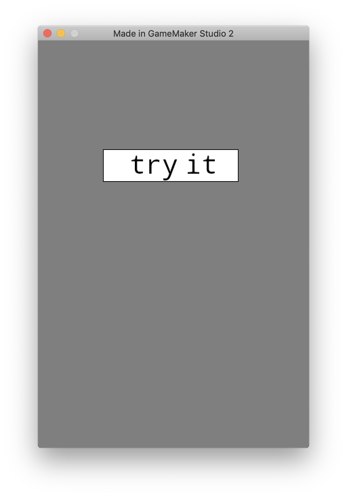
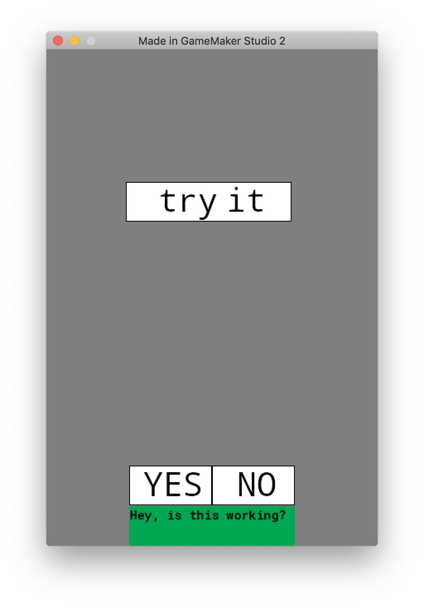
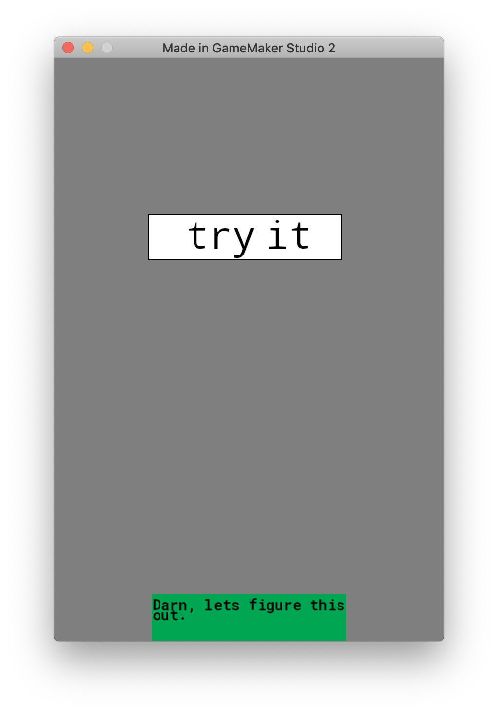

Why isn't input easier in Game Maker Studio?

A simple yes/no dialog requires quite a bit of work/code.

inspired by: https://nathanklassenprojects.wordpress.com/2019/01/09/yes-no-dialogue-pop-up-in-gml/

screenshots: 

